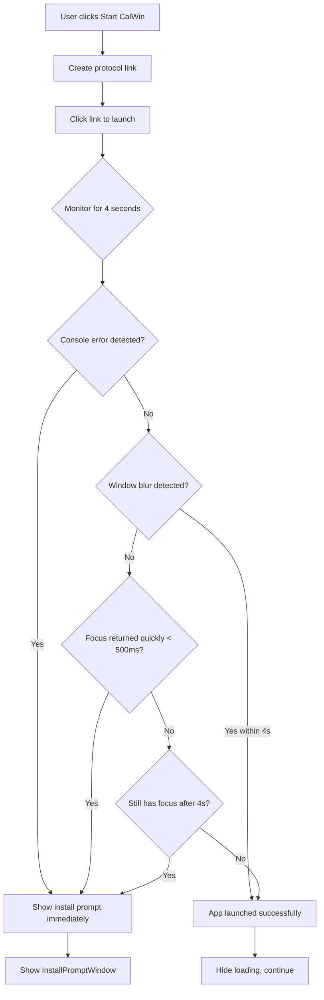

# Protocol Handler Detection Improvements

## Problem
The CalWin protocol handler detection was showing the "Install CalWin" prompt even when CalWin was already installed, particularly when:
- Users accessed the app from remote locations
- The CalWin desktop application took longer to start up (slower computers, network latency)
- The timeout expired before the app could respond

## Root Cause
The original implementation used a **2-second timeout** to detect if the protocol handler launched successfully. For users with slower systems or network conditions, CalWin would start **after** the timeout expired, causing a false negative detection.

### Original Detection Logic
```typescript
// Old timeout: 1800ms (useLauncher.ts) and 2000ms (App.tsx)
setTimeout(() => {
  if (!launched) {
    // Show install prompt - but app might still be starting!
    setShowInstallPrompt(true);
  }
}, 2000);
```

## Solution Implemented

### 1. **Increased Timeout Duration**
Changed timeout from **2 seconds to 4 seconds** to give the application more time to respond:

**Files Modified:**
- `src/hooks/useLauncher.ts`: `1800ms → 4000ms`
- `src/App.tsx`: `2000ms → 4000ms`

```typescript
setTimeout(() => {
  // Check for launch success
}, 4000); // Increased from 2000ms
```

### 2. **Browser Console Error Detection**
Added monitoring for browser-native error messages that explicitly indicate protocol handler failure:

```typescript
// Monitor console for protocol handler errors (Chrome/Edge specific)
const originalConsoleError = console.error;
console.error = function(...args: unknown[]) {
  const message = args.join(' ');
  if (message.includes('Failed to launch') && 
      message.includes('because the scheme does not have a registered handler')) {
    explicitFailure = true; // Definitely not installed
  }
  originalConsoleError.apply(console, args);
};
```

**Browser Messages Detected:**
- ✅ `"Failed to launch 'calwindev://...' because the scheme does not have a registered handler"`
- ✅ `"Launched external handler for 'calwindev://...'"`

### 3. **Quick Focus Return Detection**
Added detection for when window focus returns very quickly (< 500ms), which typically indicates the protocol handler failed immediately:

```typescript
const handleFocus = () => {
  const timeSinceLaunch = Date.now() - launchTime;
  // If focus returns very quickly (< 500ms), likely a failure
  if (timeSinceLaunch < 500 && !launched) {
    explicitFailure = true;
  }
};
```

### 4. **Improved User Communication**
Updated the InstallPromptWindow to explain that the detection might have been premature:

**New message:**
> "We couldn't detect CalWin on your computer. If you already have CalWin installed, it might just be starting up slowly. Please wait a moment and try again."

## Detection Flow (After Changes)



## Benefits

### Before
- ❌ 2-second timeout too short for slower systems
- ❌ False positives on remote connections
- ❌ No explicit browser error detection
- ❌ User confusion when CalWin was already installed

### After
- ✅ 4-second timeout accommodates slower systems
- ✅ Explicit browser error detection (console monitoring)
- ✅ Quick focus return detection (< 500ms = failure)
- ✅ Better user messaging explaining possible delays
- ✅ Three layers of detection:
  1. Console error messages (explicit failure)
  2. Quick focus return (< 500ms = likely failure)
  3. Timeout with blur detection (4s grace period)

## Technical Details

### Detection Layers

**Layer 1: Explicit Failure (Immediate)**
- Browser console error: "Failed to launch... scheme does not have a registered handler"
- Focus returns in < 500ms
- **Action:** Show install prompt immediately

**Layer 2: Window Events (Within 4 seconds)**
- Window blur event fires (app took focus)
- Visibility change event fires (app came to foreground)
- **Action:** Mark as successful launch

**Layer 3: Timeout (After 4 seconds)**
- No blur/visibility change detected
- Window still has focus
- **Action:** Show install prompt (likely not installed)

### Browser Compatibility

| Browser | Console Detection | Blur Detection | Visibility Detection |
|---------|------------------|----------------|---------------------|
| Chrome/Edge | ✅ Full support | ✅ Works | ✅ Works |
| Firefox | ⚠️ Limited | ✅ Works | ✅ Works |
| Safari | ⚠️ Limited | ✅ Works | ✅ Works |
| Opera | ✅ Full support | ✅ Works | ✅ Works |

**Note:** Even if console detection doesn't work, the other two layers still provide reliable detection.

## Configuration

To adjust the timeout duration, modify these values:

**`src/hooks/useLauncher.ts`:**
```typescript
}, 4000); // Adjust this value (milliseconds)
```

**`src/App.tsx`:**
```typescript
}, 4000); // Adjust this value (milliseconds)
```

**Recommended values:**
- **Fast networks/local:** 3000ms (3 seconds)
- **Normal conditions:** 4000ms (4 seconds) ⭐ Current
- **Slow networks/remote:** 5000ms (5 seconds)

## Testing Scenarios

### Test 1: CalWin Not Installed
1. Click "Start CalWin" button
2. Browser shows console error immediately
3. Install prompt appears within 500ms
4. ✅ Expected: Immediate detection

### Test 2: CalWin Installed (Fast System)
1. Click "Start CalWin" button
2. CalWin launches within 1-2 seconds
3. Window blur event fires
4. Loading indicator disappears
5. ✅ Expected: No install prompt

### Test 3: CalWin Installed (Slow System)
1. Click "Start CalWin" button
2. CalWin takes 3-4 seconds to launch
3. Window blur event fires before timeout
4. Loading indicator disappears
5. ✅ Expected: No install prompt

### Test 4: Remote Access (Network Delay)
1. Click "Start CalWin" from remote location
2. CalWin takes 3.5 seconds to respond
3. Window blur detected within 4-second window
4. ✅ Expected: No install prompt

## Future Improvements

### Potential Enhancements
1. **Adaptive Timeout**: Learn from previous launch times and adjust timeout dynamically
2. **Retry Mechanism**: Auto-retry detection if initial check is uncertain
3. **User Preference**: Allow users to set detection sensitivity
4. **Backend Ping**: Check if CalWin is running via backend health endpoint

### Alternative Detection Methods
- WebSocket connection to CalWin (if running)
- Local storage flag set by CalWin on first launch
- Browser extension bridge (for enterprise deployments)

## Date Implemented
November 4, 2025

## Related Files
- `src/hooks/useLauncher.ts` - Protocol launch detection hook
- `src/App.tsx` - Main app launch logic
- `src/components/InstallPromptWindow.tsx` - Install prompt UI
- `src/components/InstallPromptWindow.css` - Install prompt styles
- `docs/PROTOCOL_HANDLER_FALLBACK.md` - Original implementation docs
